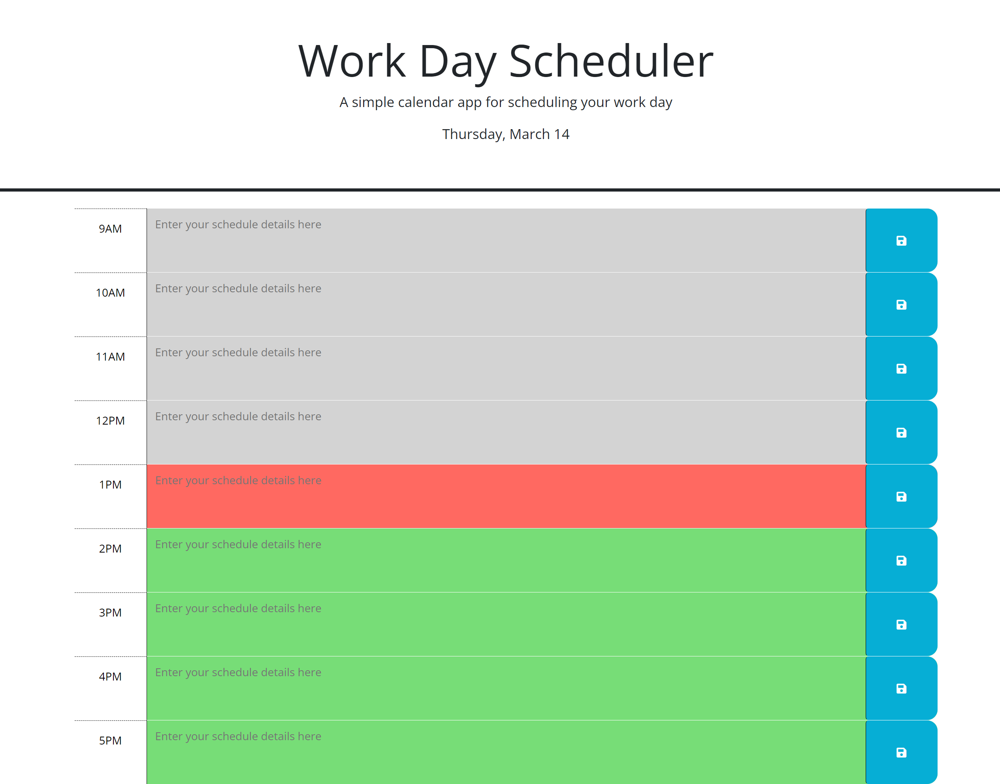

# workday-scheduler

## Project Description

A study in modifying a daily schedule to dynamically update CSS by utilizing JQuery and DayJS

## Contents

- [Introduction](#introduction)
- [Problem](#problem)
- [Solution](#solution)
- [Deployment](#deployment)
- [Collaborators](#collaborators)
- [Resources](#resources)
- [License](#License)

## Introduction

For this project I set out to modify starter code I was given for a simple daily schedule app. I utilized the JQuery & DayJS APIs to allow the site styles to update dynamically depending on the time of day.

## Problem

The client specified the following requirements for this project:

- GIVEN I am using a daily planner to create a schedule
- WHEN I open the planner
- THEN the current day is displayed at the top of the calendar
- WHEN I scroll down
- THEN I am presented with time blocks for standard business hours of 9am to 5pm
- WHEN I view the time blocks for that day
- THEN each time block is color-coded to indicate whether it is in the past, present, or future
- WHEN I click into a time block
- THEN I can enter an event
- WHEN I click the save button for that time block
- THEN the text for that event is saved in local storage
- WHEN I refresh the page
- THEN the saved events persist

## Solution

I rectified the above problems in the following ways:

- Utilized DayJS to call for the current date and formatted it to appear at the head of the page on load.
- Cloned the template div for each time block in the schedule (9AM to 5PM), and dynamically updated its properties.
- Added save button functionality so that user input is able to be saved and recalled from local storage.
- Utilized DayJS to compare each time block in the schedule to the user's current time, then update its CSS to reflect whether it is in the past, present, or future.

See below for a screenshot of the project.

## Deployment

[Link to the GitHub repo for this project](https://github.com/Aoliva96/workday-scheduler)

[Link to the deployed project on GitPages](https://aoliva96.github.io/workday-scheduler)

## Collaborators

I utilized the EdX Xpert Learning Assistant to explain code concepts and provide suggestions for which code and techniques would best suit this project. I also referred to the documentation for DayJS and JQuery.

## Resources

See the links below to see some of the resources I used for this project:

[DayJS API Documentation](https://day.js.org/docs/en/installation/installation)

[JQuery API Documentation](https://api.jquery.com/)

## License

This project utilizes the standard MIT License.
